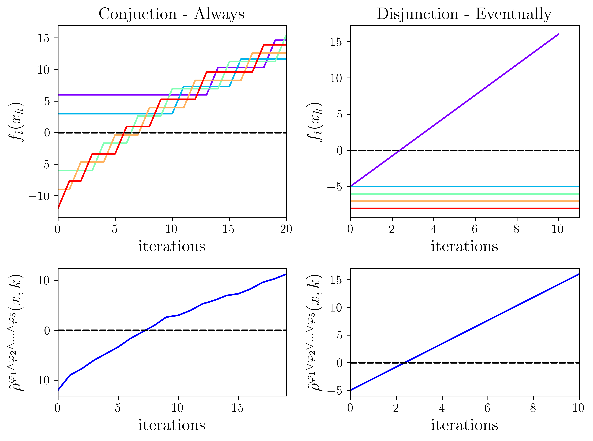
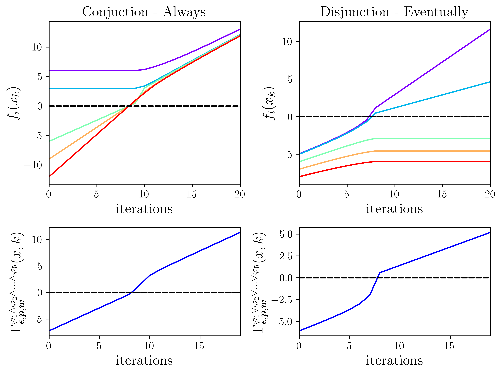
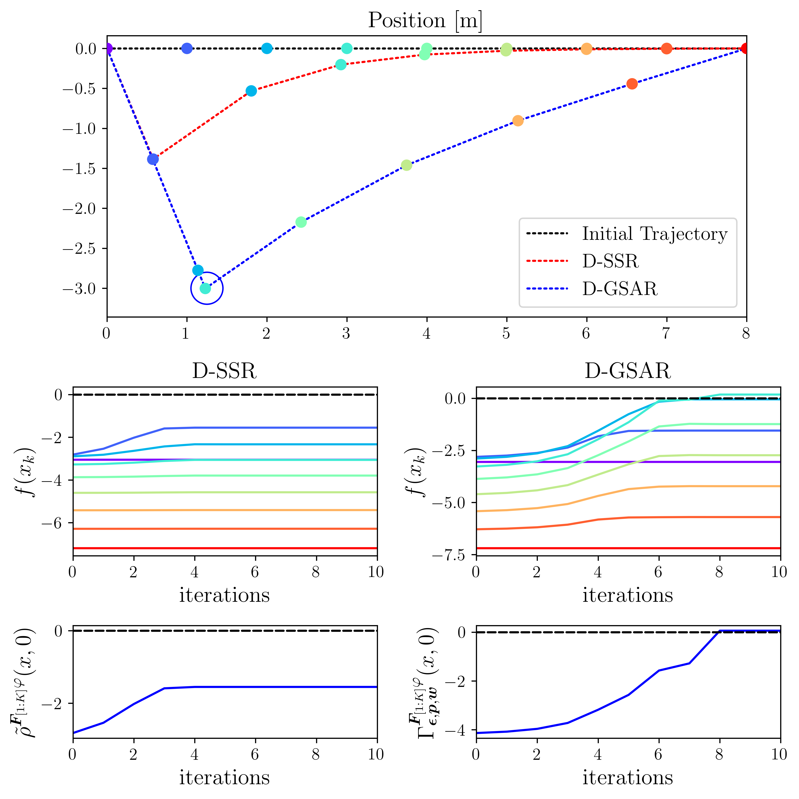
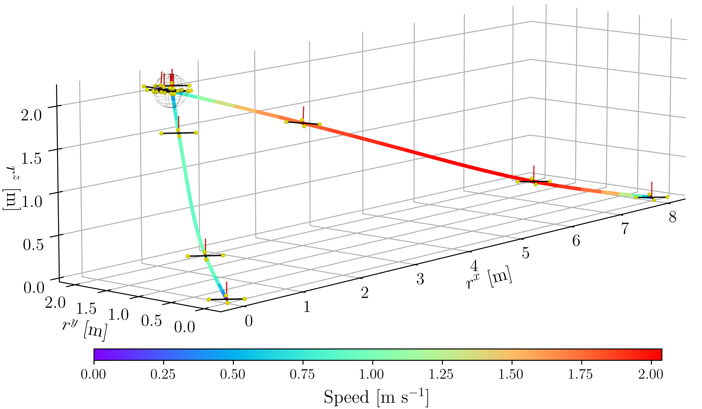
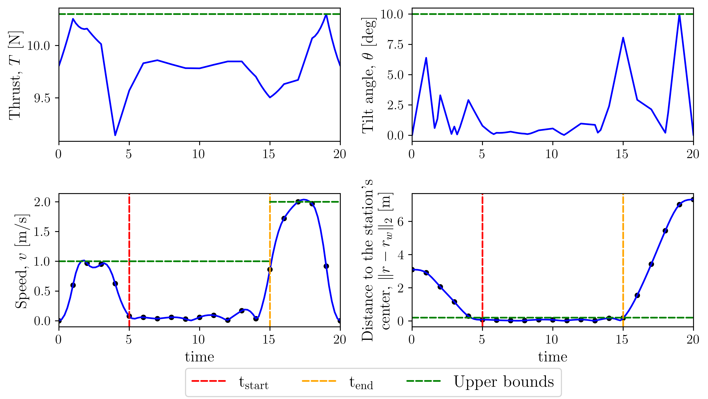
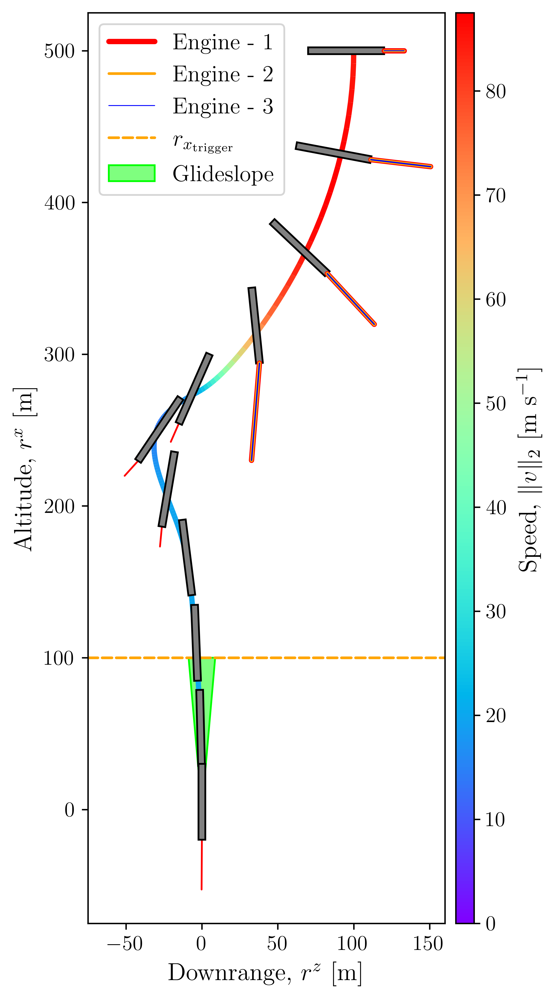
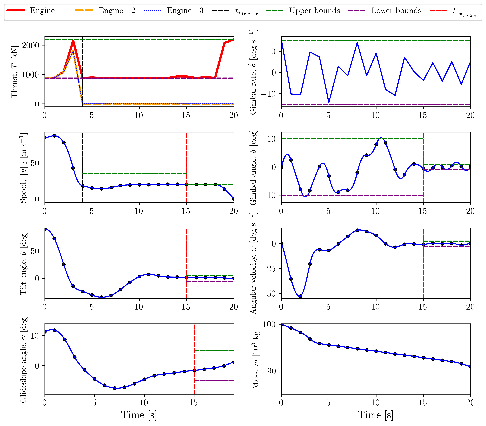

### Optimization with Temporal and Logical Specifications via Generalized Mean-based Smooth Robustness Measures (D-GMSR)


#### D-SSR Conjunction (And) & Disjunction (Or)


#### D-GMSR Conjunction (And) & Disjunction (Or)


#### Locality & Masking


#### Quadrotor flight
  - The quadrotor's speed must not exceed a specified threshold until it stops at the battery charging station for a consecutive number of time steps.



#### Autonomous rocket landing
  - 5 Speed-trigerred, 9 Altitide-trigerred constraints



## Preprint

```
@article{uzun2024optimization,
  title={Optimization with Temporal and Logical Specifications via Generalized Mean-based Smooth Robustness Measures},
  author={Uzun, Samet and Elango, Purnanand and Garoche, Pierre-Loic and Acikmese, Behcet},
  journal={arXiv preprint arXiv:2405.10996},
  year={2024},
  url={https://doi.org/10.48550/arXiv.2405.10996}
}
```
