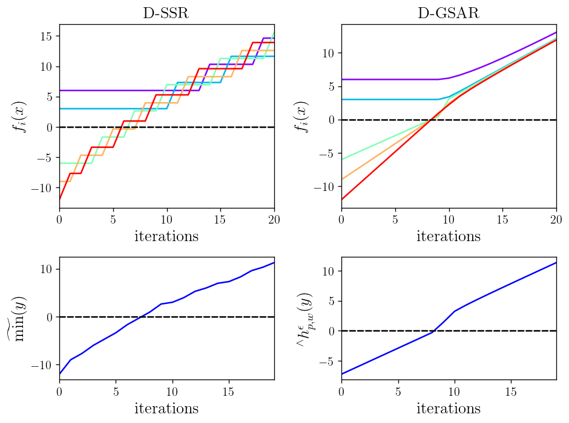
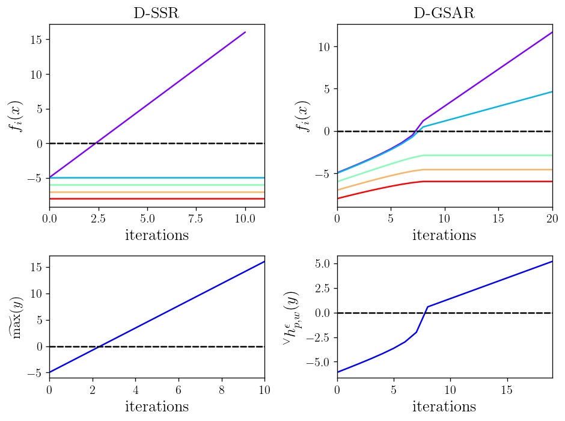

### Generalized Smooth Average-based Robustness for Optimization with Signal Temporal Logic Specifications (D-GSAR)

#### Conjunction (And) D-SSR vs. D-GSAR

#### Disjunction (Or) D-SSR vs. D-GSAR

#### Locality & Masking

#### Quadrotor flight
  - The quadrotor's speed must not exceed a specified threshold until it stops at the battery charging station for a consecutive number of time steps.

#### Autonomous rocket landing
  - 5 Speed-trigerred, 9 Altitide-trigerred constraints

