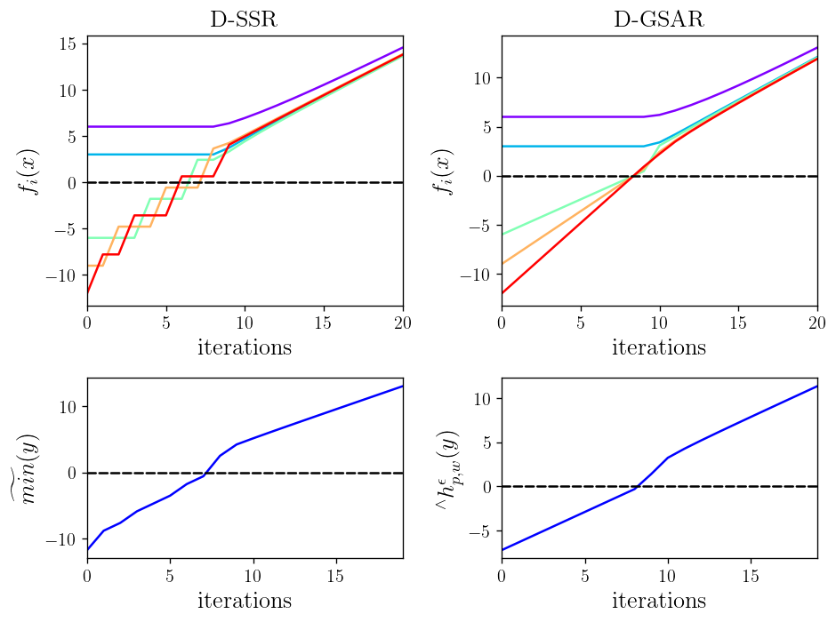
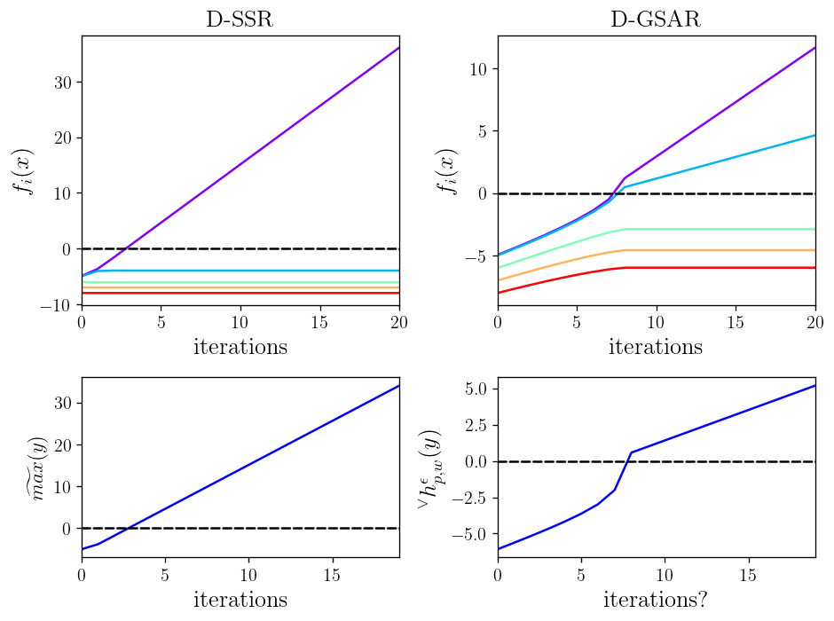
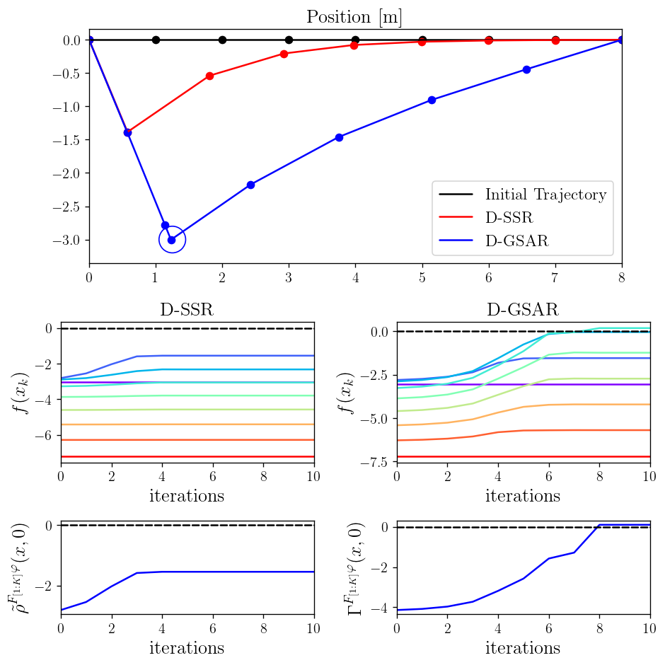
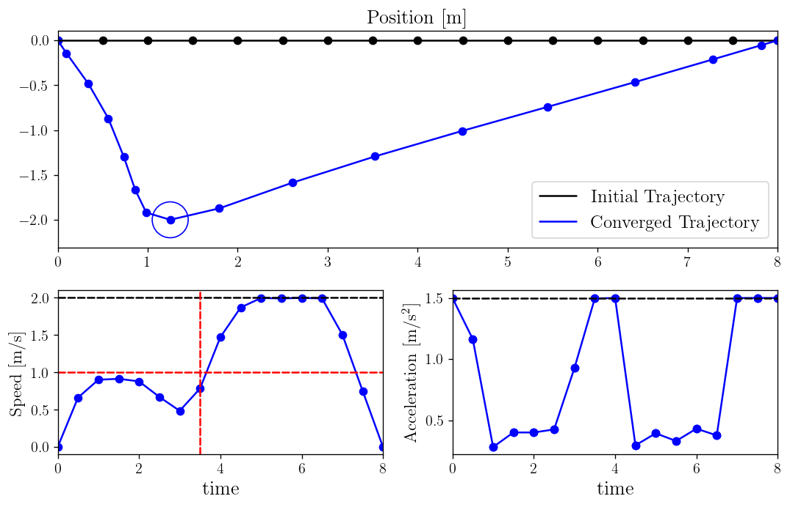

### Generalized $\mathcal{C}^1$-smooth Average-based Robustness for Optimization with Signal Temporal Logic Specifications (D-GSAR)

#### Conjunction (And) D-SSR vs. D-GSAR

#### Disjunction (Or) D-SSR vs. D-GSAR

#### Locality & Masking

#### Numerical Example
  - The speed must be less than 1 m/s until the vehicle reaches the waypoint
